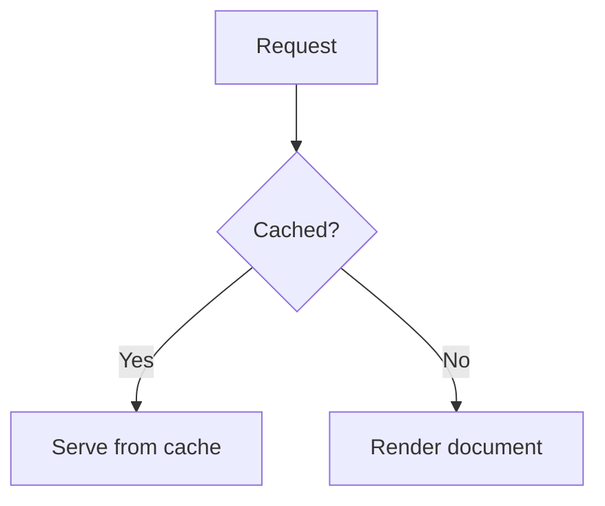

# Rich Content

## Formatting

**Bold**, _italic_, ~~strikethrough~~, `inline code`,
[links](https://laravel.com) and blockquotes all render with sensible
default styling. GFM tables and task lists also work:

```markdown
| Strategy | Behaviour |
|---|---|
| `filename` | Slug from path. |
| `metadata` | Slug from front-matter. |

- [x] Done
- [ ] Pending
```

## Callouts

GitHub-style alerts produce coloured blocks with a matching icon:

```markdown
> [!NOTE]
> Useful information users should know.

> [!TIP]
> A helpful suggestion.

> [!IMPORTANT]
> A non-obvious detail.

> [!WARNING]
> Something that needs caution.

> [!DANGER]
> A destructive action — proceed carefully.

> [!CAUTION]
> An older synonym for danger; same styling.
```

> [!NOTE]
> Useful information users should know.

> [!TIP]
> A helpful suggestion.

> [!WARNING]
> Something that needs caution.

> [!DANGER]
> A destructive action — proceed carefully.

Each callout uses its own accent colour driven by `--dc-callout-color`.

## Code blocks

Fenced code blocks get a language label and a copy button:

````markdown
```php
Route::get('/docs', function () {
    return view('laradocs::layout');
});
```
````

Code without a language renders as plain `<pre>` with no header chrome.
Tilde fences (`~~~`) are recognised the same as backtick fences. Inline
`` `code` `` keeps a soft background and hairline border so it stands
out without shouting.

## Images

Images are lazy-loaded and a markdown title becomes a caption:

```markdown

```

Images inside the prose are clickable to zoom — they expand to fill the
viewport with a darkened backdrop and clicking again dismisses.

## Video

Local files become a `<video>` player, and YouTube / Vimeo links
become responsive embeds:

```markdown


[Watch the intro](https://youtu.be/dQw4w9WgXcQ)
```

Only the YouTube and Vimeo hosts are embedded — other video links are
left as plain hyperlinks.

## Diagrams

A fenced block tagged `mermaid` renders as an SVG diagram:

````markdown

````

[mermaid.js](https://mermaid.js.org) is imported lazily and only on pages
that contain a diagram, so pages without one pay nothing. The diagram
follows the active colour scheme — its theme variables are mapped from the
same `--dc-*` tokens as the rest of the UI and re-render when you toggle
dark mode.

When JavaScript is disabled the graph definition stays on the page as a
styled code block, so the content is never lost.

Disable the feature with `parser.extensions.mermaid => false`, or point
`parser.mermaid.src` at a self-hosted ESM build (or set `LARADOCS_MERMAID_SRC`)
to avoid the CDN.

## Math

KaTeX renders LaTeX math, loaded lazily and only on pages that contain an
expression.

**Inline math** — wrap in single dollar signs:

```markdown
The famous equation $E = mc^2$ changed physics.
```

**Display (block) math** — place `$$` alone on its own line:

```markdown
$$
\frac{-b \pm \sqrt{b^2 - 4ac}}{2a}
$$
```

A single-line shorthand also works:

```markdown
This identity $$e^{i\pi} + 1 = 0$$ is block-display math.
```

Before KaTeX loads the raw expression is shown in monospace; once loaded
KaTeX renders it synchronously so there is no perceptible layout shift.
When JavaScript is disabled the raw LaTeX source remains readable.

Point `parser.katex.js` and `parser.katex.css` at self-hosted builds (or
set `LARADOCS_KATEX_JS` / `LARADOCS_KATEX_CSS`) to avoid the CDN.

Enable server-side rendering via `LARADOCS_KATEX_SSR=true` — this requires
Node.js and the `katex` npm package to be available on the server. When
absent, the extension falls back to client-side rendering automatically.

Disable the feature with `parser.extensions.katex => false`.

## Footnotes

```markdown
Markdown supports footnotes[^1] — the link jumps to the definition at
the bottom of the page.

[^1]: Like this one.
```

## Attribute lists

Append `{.class #id key=value}` to a block to attach attributes:

```markdown
This paragraph has an id. {#hero}

> A blockquote with a custom class. {.callout-special}
```

This pairs nicely with the published CSS — add a class in markdown,
style it in your CSS overrides.

## Heading anchors

Every `<h2>` and `<h3>` gets an auto-generated `id` and a hover-revealed
`#` link, making any heading deep-linkable.

## Table of contents

When a page has at least `parser.toc.min_headings` headings inside the
`parser.toc.min_level`–`parser.toc.max_level` range (defaults `2`/`2`/`3`),
the right-hand TOC populates automatically and scrollspy keeps the
current section highlighted.
